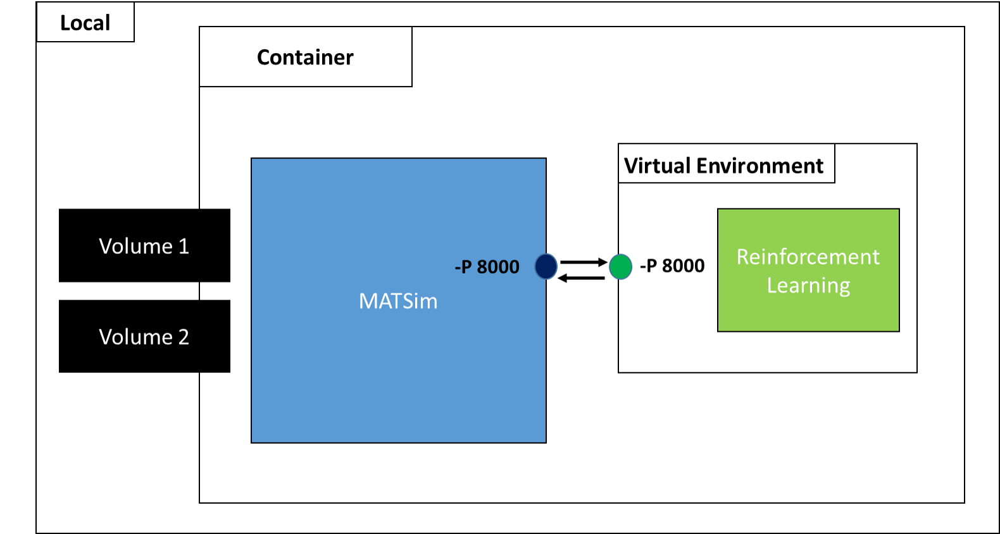

# a7-rl-testbed

This repository incoporates a reinforcement learning decision making in matsim within-day planning for single agent.

---

## 1. Terminology & Parameter Glossary

### 1.1 Core Architecture Frameworks
* **MATSim (Multi-Agent Transport Simulation):** An open-source, extensible Java framework designed for simulating microscopic, agent-based transport systems and traffic dynamics.
* **RL (Reinforcement Learning):** A machine learning paradigm where an autonomous entity (agent) learns to optimize dynamic control loops through sequential trial-and-error interactions.
* **MDP (Markov Decision Process):** A mathematical framework utilized to model discrete-time stochastic control processes where outcomes are partly random and partly controlled by a decision-maker.

### 1.2 Runtime Environment Flags
* **`MATSIM_ITERATION`:** Defines the starting iteration index within the execution loop (typically initialized to `1`).
* **`MAX_TRAINING_ITERATION`:** The absolute terminal iteration floor for the policy update engine. The simulation execution sequence terminates once this training cycle limit is met.
* **`AGENT_LIST`:** A configuration switch (`true`/`false`) controlling whether the system tracks the complete global simulation register or narrows focus to specific agent IDs.
* **`NUM_THREADS`:** Configures parallel execution scaling. Allocating more CPU cores limits bottleneck states during multi-agent route calculations.

---

## 2. Methodology
The core framework models individual traveler mode choice optimization as a Markov Decision Process (MDP) solved via a Tabular Q-Learning engine. Rather than sharing behavioral policies via a centralized global layout, agents undergo Individual Learning. This layout preserves localized schedule habits, unique spatial constraints, and distinct vehicle asset access privileges.

### 2.1 Reinforcement Learning
To capture the sequential, adaptive nature of daily travel planning, this study models the multi-leg mode choice problem through the lens of Reinforcement Learning (RL). Under this paradigm, an autonomous agent interacts with a dynamic transportation environment over a series of discrete iterations, learning an optimal behavioral policy through trial and error.


At each decision node (the beginning of a trip leg), the agent observes its current environmental context ($S$), executes a transit mode action ($A$), and transitions to the next activity location ($S'$). Upon completing its daily travel itinerary, the agent receives a feedback for each step in the form of a scalar reward ($R$), rather than at the end of the day.

---

### 2.2 Tabular Q-Learning Mechanics

The optimization engine behind the independent mode-choice adjustments relies on model-free, value-based Tabular Q-Learning. The agent utilizes an internal discrete matrix lookup array—the **Q-Table**—where rows map to the unique encoded **151-Bit DNA State** configurations, and columns map to the four discrete structural travel actions (`car`, `pt`, `bike`, `pedestrian`). 

Each index cell contains an expected long-term utility score, known as a **Q-value** ($Q(s, a)$).

#### 2.2.1 The Value Update Equation
Q-values are dynamically modified at the end of each daily simulation loop using a temporal-difference learning cycle governed by the standard Bellman Equation:

$$Q(s, a) \leftarrow Q(s, a) + \alpha \left[ R + \gamma \max_{a'} Q(s', a') - Q(s, a) \right]$$

Where:
* **$Q(s, a)$**: The current expected utility estimation of taking a specific transit action within the current spatial-temporal state.
* **$\alpha$ (Learning Rate)**: Controls the speed of model updates ($0 < \alpha \le 1$). A value closer to 1 shifts policy weight aggressively to the newest day's experienced reward, while lower values smooth out updates over multiple iterations.
* **$R$ (Scalar Reward Feedback)**: The structural utility feedback derived directly from the MATSim performance loops, calculated via the integrated **Kai-Nagel Wrap-Around logic**.
* **$\gamma$ (Discount Factor)**: Determines the agent's long-term foresight horizon ($0 \le \gamma < 1$). Higher values force the agent to prioritize maximizing scores for downstream legs rather than rushing into immediate high-reward actions on early trips.
* **$\max_{a'} Q(s', a')$**: The maximum estimated future reward possible from the next sequential trip leg's state ($s'$).

#### 2.2.2 Action Selection and Epsilon Decay Schedule
To navigate the trade-off between refining known high-value travel routines and uncovering hidden multi-modal connections, action selection is governed by an **$\epsilon$-greedy exploration policy**:

$$\text{Action} = \begin{cases} 
\text{Random Mode Choice} & \text{with probability } \epsilon \\ 
\arg\max_{a} Q(s, a) & \text{with probability } 1 - \epsilon 
\end{cases}$$

---

### 2.3 MATSim + Reinforcement Learning Framework Integration

The operational architecture of this project relies on a distributed microservice framework that bridges two distinct programming ecosystems: the physical mobility simulator and the adaptive artificial intelligence backend.

#### 2.3.1 Front-End Execution: MATSim (Java)
The front-end of the application is native to **Java** using the **MATSim (Multi-Agent Transport Simulation) 2026 Core**. MATSim is strictly responsible for handling the physics of the transport ecosystem, resolving network gridlock, tracking physical vehicle constraints, and generating the baseline mobility scenario configurations. 

During the simulation loop, Java acts as the telemetry provider. It leverages custom event handlers (`WithinDayAgentUtils`) to freeze the agent's execution loop at critical trip leg intersections to extract raw spatial-temporal parameters.

#### 2.3.2 Back-End Decision Engine: RL Service (Python)
The Reinforcement Learning optimization engine runs natively inside a **Python 3.12 environment**. Python isolates the behavioral logic, handling the complex mathematical routines behind value matrix updates, tracking independent multi-agent Q-tables, and calculating policy exploration decay schedules. It treats the data incoming from the front-end purely as state inputs, processing it without needing to understand the underlying mechanical physics of MATSim's traffic queues.

#### 2.3.3 The Communication Layer: SSH Network and CRUDE Pipeline
To cross the runtime boundary between the Java JVM and the Python interpreter, communication is bound through a **SSH network bridge** utilizing a continuous **CRUDE (Create, Read, Update, Delete, Execute) data pipeline**. 

The lifecycle of a single multi-leg mode decision flows through this pipeline step-by-step:
1. **Trigger (Java):** An agent reaches an activity end-time and initializes a trip leg request.
2. **Serialize & POST (Java $\rightarrow$ Python):** The Java encoder serializes the agent's spatial-temporal parameters into a discrete state array. This is dispatched securely across the established SSH loop.
3. **Process & GET (Python):** The Python backend reads the incoming state string, logs the feedback to update the individual's specific tabular array cell, runs the $\epsilon$-greedy policy selection, and chooses a structural action (e.g., `pt`, `car`).
4. **Return & Execute (Python $\rightarrow$ Java):** The chosen transit mode action is returned through the SSH pipeline to the Java front-end, where MATSim updates the active agent's plan profile on the fly and simulates their route across the network.
5. **Trigger (Java):** The agent reaches the desired targeted activity and initializes a reward request.
6. **POST (Java $\rightarrow$ Python):** The Java than sends the reward associated with the action and the prediction of the next state.

---

## 3. Deployment & Execution Guide

This section outlines the hardware prerequisites, cross-platform dependencies, and specific execution sequences required to initialize the distributed Java-Python simulation lifecycle.

### 3.1 System Requirements & Container Registries

#### 3.1.1 Hardware Prerequisites
* **Processor:** Minimum 4 Cores (8 Cores recommended to handle concurrent multi-agent network routing threads).
* **Memory:** Minimum 8 GB RAM allocated to the Java Virtual Machine (JVM) heap space for processing scenario configurations.
* **Storage:** 2 GB free disk space for simulation iterations, Q-table serialization blocks, and logging outputs.

#### 3.1.2 Core Dependencies
* **Java Development Kit (JDK):** Version 25 (Required for compiling and executing the MATSim 2026 Core).
* **Python Runtime:** Version 3.12 or newer.

#### 3.1.3 Containerization Engines
To replicate the network execution environment across varying operating systems without manual local port configuration, deploy via Docker. Download your platform-specific container engine directly from the official Docker Hub registries:
* **Windows Environments (Docker Desktop with WSL2 Backend):** https://hub.docker.com/editions/community/docker-ce-desktop-windows
* **Linux Environments (Native Docker Engine Core):** https://hub.search.brave.com/search?q=docker&type=image



---

### 3.2 Execution Sequences

#### Option A: Containerized Cluster Deployment (Recommended)
This approach leverages automated container composition to expose isolated network ports and instantly bind the SSH bridge/CRUDE data pipeline.

1. **Build the docker image:**
    ```powershell
    docker build -t {image_name}:{version} .

    Note: Ensure the trailing period '.' is present to specify the local context compilation path.

2. **Run the container:**
   Run the following command block to spin up the simulation engine. This configuration passes optimization constants, sets network port communications, and mounts local directories to process simulation input/output files:
   
   ```powershell
   docker run --rm -it `
        -e MATSIM_ITERATION=1 `
        -e AGENT_LIST=false `
        -e MAX_TRAINING_ITERATION=5 `
        -e NUM_THREADS=1 `
        -e JAVA_HEAP=12g `
        -p 8000:8000 `
        -v "{matsim_input_file_path}:/app/scenarios/sioux-falls/input/" `
        -v "{matsim_output_file_path}:/app/scenarios/sioux-falls/output/" `
        {image_name}:{version}

